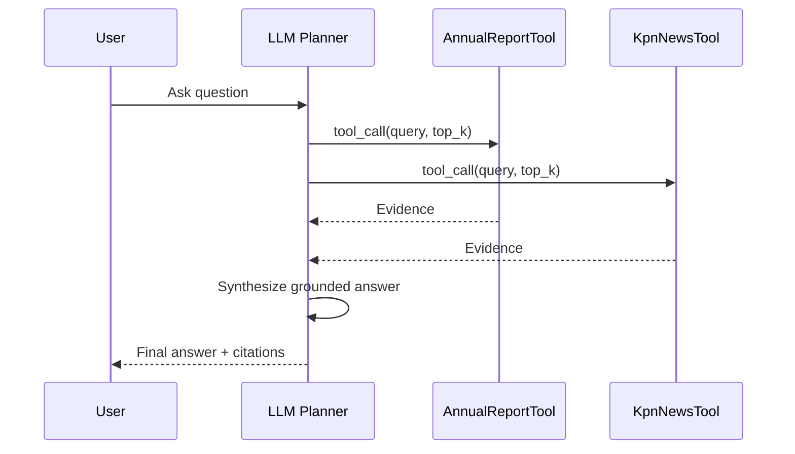

# KPN Agentic RAG (Local Baseline)

This repository contains a simple, modular local baseline for a KPN-focused agentic RAG system.

## What is implemented

- Ingestion pipeline for KPN news pages.
- Text extraction and chunking.
- Metadata-enriched records (timestamps, depth, hashes, source URL, status).
- Local ChromaDB persistence.
- LLM-based tool-calling orchestrator for routing, retrieval, and grounded answer synthesis.
- Modular package layout under `src/`.

## Repository structure

- `src/kpn_agent/common`: Shared helpers (hashing, text, jsonl).
- `src/kpn_agent/config.py`: Runtime defaults and path config.
- `src/kpn_agent/ingestion`: Crawler and chunk builder.
- `src/kpn_agent/storage`: ChromaDB client and operations.
- `src/kpn_agent/pipelines`: End-to-end ingestion pipelines.
- `src/app`: FastAPI app and LLM orchestration service.
- `scripts/kpnnews_script.py`: CLI wrapper for ingestion.
- `scripts/run_api.py`: FastAPI launcher.
- `data/raw`: Raw crawled JSONL outputs.
- `data/processed`: Chunked JSONL outputs.
- `data/vector_store`: Local vector DB persistence.
- `data/logs`: LLM orchestration run logs and traces.
- `docs`: Design and implementation notes.

## Setup

Install packages in your environment:

```bash
pip install -r requirements.txt
```

## Usage

### 1) Ingest news data

```bash
python scripts/kpnnews_script.py
```

Useful options:

```bash
python scripts/kpnnews_script.py --max-pages 50 --max-depth 2 --skip-chroma
python scripts/kpnnews_script.py --collection kpn_news --persist-dir data/vector_store/chroma_store
```

### 2) Build indexes for API queries

The API query path uses these retrieval tools:

- `kpn_news_tool`: retrieval-only tool over the `kpnnews` index.
- `kpn_quarterlyreports_tool`: retrieval-only tool over the `kpnquarterlyreports` index.

Before querying KPN news, build or refresh the news index:

```bash
python scripts/test_kpnnews_ingest.py --seed-url "https://www.overons.kpn/nieuws/en" --allowed-domain overons.kpn
```

Before querying quarterly reports, build the quarterly index once:

```bash
python scripts/test_quarterly_ingest.py
```

### 3) Run API (FastAPI)

Start locally:

```bash
python scripts/run_api.py --host 127.0.0.1 --port 8000
```

Endpoints:

- `GET /health`
- `POST /query`

Example request:

```bash
curl -X POST http://127.0.0.1:8000/query \
	-H "Content-Type: application/json" \
	-d '{"query":"What are the latest KPN announcements?","top_k":4,"max_tool_rounds":2}'
```

### 4) Dockerize And Run API

Build image:

```bash
docker build -t kpn-agent-api .
```

Run container (mount `data` to persist Chroma store and logs):

```bash
docker run --rm -p 8000:8000 \
	--env-file .env \
	-v ./data:/app/data \
	kpn-agent-api
```

Test:

```bash
curl http://127.0.0.1:8000/health
curl -X POST http://127.0.0.1:8000/query \
	-H "Content-Type: application/json" \
	-d '{"query":"What are the latest KPN announcements?"}'
```

What this validates:

- LLM-based tool routing.
- One-tool and two-tool orchestration paths.
- Evidence merging and citation formatting.
- Final answer synthesis contract.
- Local observability trace logging.

Index names used by the real tools:

- `kpnnews`
- `kpnquarterlyreports`

Quarterly flow is now separated:

- `scripts/test_quarterly_ingest.py` builds or updates the `kpnquarterlyreports` index.
- `kpn_quarterlyreports_tool` only queries the index at request time.

KPN news flow is now separated:

- `scripts/test_kpnnews_ingest.py` builds or updates the `kpnnews` index by crawling KPN news pages with BeautifulSoup.
- `kpn_news_tool` only queries the index at request time.

### 5) Tiny sequence diagram (LLM tool-calling flow)



### 6) Test KPN news index build/update (incremental crawl)

This script demonstrates the separated ingestion strategy for KPN news:

- Crawl latest pages from the configured news URL.
- Compare current page content hashes against already indexed content hashes.
- Keep unchanged pages untouched.
- Replace chunks only for new or changed pages in `kpnnews`.

Run ingestion/update:

```bash
python scripts/test_kpnnews_ingest.py --seed-url "https://www.overons.kpn/nieuws/en" --allowed-domain overons.kpn --max-pages 30 --max-depth 2
```

For hourly change tracking, run the same command from your scheduler every hour.

## Output artifacts

- Raw docs: `data/raw/kpn_news_raw.jsonl`
- Chunks: `data/processed/kpn_news_chunks.jsonl`
- Vector store: `data/vector_store/chroma_store`
